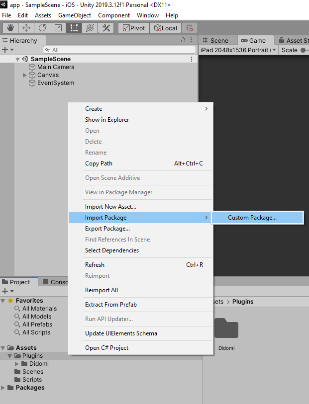

Unity SDK (Plugin) for the Didomi CMP
==============================

This repository contains the source code for the Didomi Unity
plugin and sample. This plugin enables Unity developers to easily use Didomi functionality
on Android and iOS apps without having to write Java or Objective-C code.
The plugin provides a C# interface for requesting calls on Didomi Native that is used by C#
scripts in your Unity project.

# Downloads

Please check out our
[releases](//github.com/didomi/unity/releases)
for the latest official version of the plugin.

# Documentation

For instructions on using the plugin, please refer to
[this developer guide](//developers.didomi.io/cmp/unity-sdk/reference-unity).

# Requirements

Unity Version 2019.3.12f1 or later

# SetUp

For details, please refer to
[this developer guide](//developers.didomi.io/cmp/unity-sdk/setup-unity).

## Use Sample

Clone this repository and open it in Unity.  You can start to extract projects for Android and IOS.

## To Install plugin in your Unity project



To be able to install Didomi Unity package, go to menu on UNITY as above image and click "Import Package" Didomi as name for package. Didomi.unitypackage contents will be copied to Assets folder on Unity project. 

To be able set local configuration file for Didomi, you must create DidomiConfig folder under Assets folder on Unity Project. Put your didomi_config.json file in  DidomiConfig folder.

```text
Assets/DidomiConfig/didomi_config.json
```

Creating DidomiConfig is mandatory for local configuration files. Because these files must be moved to right directories when Android and IOS projects are being generated. On the post process of the unity project, Didomi Plugin moves the files in DidomiConfig to Assets folder in Android projects and to Data/Resources folder in IOS projects. For IOS Projects the configuration files will also be added to Copy Bundle Resources.

# Contact

- Email:  jawad.stouli@didomi.io

# Suggesting improvements

To file bugs, make feature requests, or to suggest other improvements,
please use [github's issue tracker](//github.com/didomi/unity/issues).

# License

[Didomi License](Source/Plugins/Didomi/LICENSE.txt)
