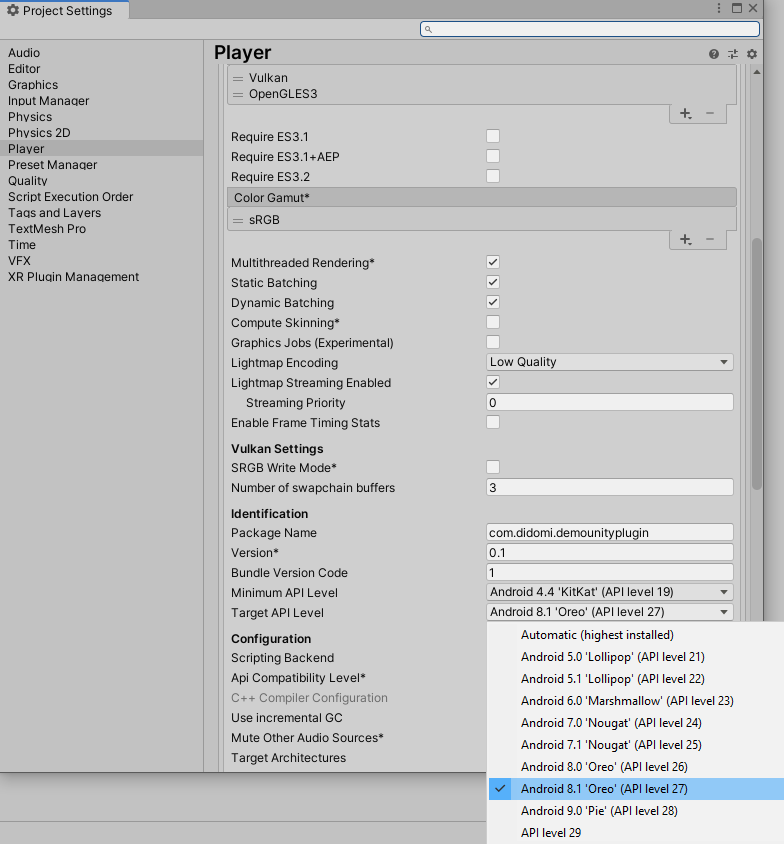

## Android Issues and Solutions

### 1- Problem & Solution

Didomi-android-sdk setupUI takes AppCompatActivity class as argument but unity generates UnityPlayerActivity class which is extending from Activitiy.
We are not able to set it as argument to setupUI method. With the default settings, we are not able use didomi-android-sdk. In order to solve the issue,
At PostProcessor.OnPostProcessBuild we changed the generated code. We change UnityPlayerActivity so that it extends from  AppCompatActivity class instead of Activitiy class. 

Default Generated Code:

```java
public class UnityPlayerActivity extends Activity implements IUnityPlayerLifecycleEvents
```

After PostProcessor.OnPostProcessBuild, the generated code is updated like below.

```java
import android.support.v7.app.AppCompatActivity;

public class UnityPlayerActivity extends AppCompatActivity implements IUnityPlayerLifecycleEvents
```

### 2- Problem & Solution

Since we updated the Activity class to AppCompatActivity, we also need to update "unityLibrary\src\main\res\values\styles.xml"  file.
So that we can set AppCompat theme to the UnityPlayerActivity. Otherwise project code gets build errors.

At PostProcessor.OnPostProcessBuild we added the below line to styles.

```xml
<style name=""DidomiTheme"" parent =""Theme.AppCompat.Light.DarkActionBar""
```

And at PostProcessor.OnPostProcessBuild, We updated unityLibrary\src\main\AndroidManifest.xml file

We replaced line the below

```xml
  @"android:theme=""@style/UnityThemeSelector""";
```
 with 

```xml
  @"android:theme=""@style/DidomiTheme""";
```

We set the theme of UnityPlayerActivity to "AppCompat Theme" by doing the above update.

### 3- Problem & Solution

Crush while loading.

Styles imported from didomi-android-sdk are not found and error is thrown. To solve the issue 

At PostProcessor.OnPostProcessBuild, We updated the dependencies and added required libs to "unityLibrary\build.gradle file.

Added dependencies to unityLibrary\build.gradle file:

```java
     implementation fileTree(include: ['*.jar'], dir: 'libs')
    implementation 'com.android.support:appcompat-v7:27.1.1'
    implementation 'com.android.support:design:27.1.1'
    implementation 'com.google.android.gms:play-services-ads:15.0.1'
    implementation "android.arch.lifecycle:extensions:1.1.0"
    implementation 'android.arch.lifecycle:viewmodel:1.1.0'
    // Force customtabs 27.1.1 as com.google.android.gms:play-services-ads:15.0.1 depends on 26.0.1 by default
    // See https://stackoverflow.com/questions/50009286/gradle-mixing-versions-27-1-1-and-26-1-0
    implementation 'com.android.support:customtabs:27.1.1'
    api 'com.iab.gdpr_android:gdpr_android:1.0.1'
    api 'com.google.code.gson:gson:2.8.5'
    api 'com.rm:rmswitch:1.2.2'
```

### 4- Problem & Solution

Build errors related to target sdk:

since diodmi-andorid-sdk uses appcompat-v7:27.1.1, For Unity  target sdk must be 27 at android player settings.    


