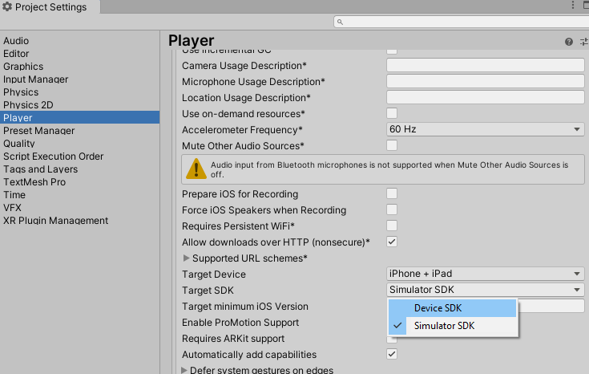

## IOS Issues and Solutions

### 1- Problem & Solution

You can have on Mac "MapFileParser.h permission denied" error. The error is thrown when we build the project. To fix the problem, Run below command on project directory.

chmod a+x MapFileParser.sh

### 2- Problem & Solution

SWIFT LANGUAGE VERSION` IS NOT SET IN XCODE BUILD SETTINGS WHEN A .SWIFT SOURCE PLUGIN IS ADDED TO AN UNITY PROJECT

This is a bug on Unity as described below link. 
https://issuetracker.unity3d.com/issues/ios-swift-language-version-is-not-set-in-xcode-build-settings-when-a-swift-source-plugin-is-added-to-an-unity-project

I got the problem on Unity 2019.3.6f. After I installed Unity 2019.3.12 problem resolved.

### 3- Problem & Solution

Error: dyld: Library not loaded: @rpath/libswiftCore.dylib

If xcode project doesnot set ALWAYS_EMBED_SWIFT_STANDARD_LIBRARIES to "yes", you will get above error.
In order to not do that process manually after each build of the xcode project,
We set the property at OnPostProcessBuild method of PostProcessor. Th below line is added to fix the problem.

proj.AddBuildProperty(targetGuid, "ALWAYS_EMBED_SWIFT_STANDARD_LIBRARIES", "YES");

### 4- Problem & Solution

If you are building for IOS simulator, it is crucial to set target SDK as "Simulator SDK" at IOS player settings at unity. Otherwise it will not run on ios simulator.
If you are getting the build for real device, set it as Device SDK. 

### 5- Problem & Solution

When I move the extracted project from windows environment to Mac on the cloud, I got a file extension problem that caused to break build.
While I move Didomi.framework to mac, binary Didomi file lost it unix extension mark. 
With the version I moved from the Windows, it didnot work. I copied the same file from mac build, and then it worked.
This is an environmental issue,It is worth to mention. 

### 6- Problem & Solution

The functions that will be invoked from C# over objective-c Didomi.mm file. In Didomi.mm file functions must be put inside extern "C{ [code] }
Otherwise symbol not found error is displayed. This protects functions names from mangling.

### 7- Problem & Solution

We move the didomi_config_ios.json to Data/Resources at OnPostProcessBuild method of PostProcessor
project.AddFileToBuild(targetGuid, fileGuid); if we didn't call add file to build simple copy operation didn't worked.

### 8- Problem & Solution

setupUI method takes IOS UIViewController as argument in original IOS SDK. 
In Unity we have UnityGetGLViewController to take view controller. We used UnityGetGLViewController function from objective C and passed it as arg to setupui.

### 9- Problem & Solution

getDisabledPurposes
getDisabledVendors
getEnabledPurposes
getEnabledVendors
getPurpose
getRequiredPurposes
getRequiredVendors
getVendor

above functions have struct type as return type. For that reason @objc cannot be placed before function declaration.
The functions are not usable at objective-c. Since Unity generates Objective-C, So they are not usable at UNITY, when you are building for IOS.

### 10- Problem & Solution

IL2CPP doesnot allow marshalling instance methods.

In order to give function as pointer to cpp, we have to give it as static method.

IL2CPP doesnot allow marshalling instance methods. So we made method static seperate method instead of instance method.

we added  [AOT.MonoPInvokeCallback(typeof(OnReadyDelegate))] to static method which is function pointer sent to CPP

This is must when managed method is sent. Learned by thrown exception.

### 11- Problem & Solution

EventListener doesnot have to implement interface on Objective C part. Below lines on swift didomi repo makes the magic. Class implementer of the interface is already available at Objective-C.

@objc(DDMEventListener)
public class EventListener: NSObject {

If you try to add, you will get "unname type" error, because it is already created by the way mentioned above.

### 12- Problem & Solution

il2cpp not supported error on newtonsoft.dll

DefaultJsonUtiliy class doesn't convert array, set and dictionary structures,
I have used NewtonSoft.dll json library. This also raised a new problem. It didn't work for ios. 
So I have used netstandard 2.0 library version of newtonsoft to not get "il2cpp not supported". It worked. But it is mentioned that this library can be used from Unity version 2018.1
on the following page https://docs.microsoft.com/en-us/dotnet/standard/net-standard.
Unity version has dependency on Unity version 2018 but we already have version dependency for 2019 due to bug on https://issuetracker.unity3d.com/issues/ios-swift-language-version-is-not-set-in-xcode-build-settings-when-a-swift-source-plugin-is-added-to-an-unity-project

It is important to note that here.

https://stackoverflow.com/questions/16359628/json-net-under-unity3d-for-ios
