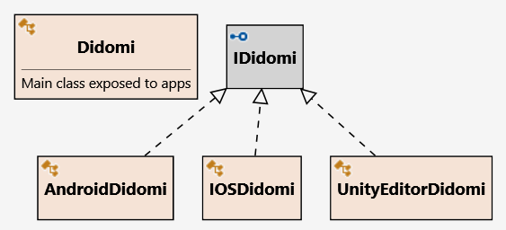
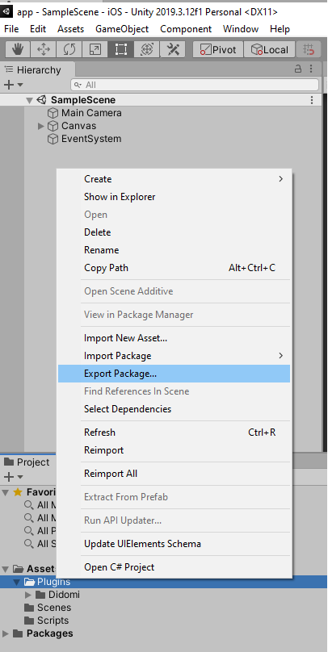
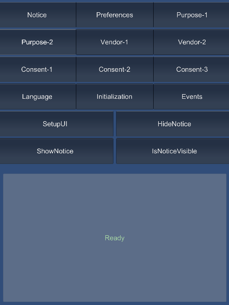

# Didomi Unity plugin Internal Documentation

This document explains how the Didomi Unity plugin is structured and how to work on it.  
This is an internal documentation for developers who want to modify the plugin itself, not include it in their app.

## Overview

Unity has support for native plugins that are libraries of native code written for different platforms. The Didomi Unity plugin supports Android and iOS by wrapping the [Didomi native mobile SDKs](https://developers.didomi.io/cmp/mobile-sdk).

The plugin embeds the mobile SDKs in Unity projects by adding them to platform-specific folders ([`Plugins/Didomi/Android`](../source/Assets/Plugins/Didomi/Android) and [`Plugins/Didomi/IOS`](../source/Assets/Plugins/Didomi/IOS)).

This plugin is built in two parts:

### Native calls

Unlike other parts of Unity development, native plugins require platform-specific calls and interfaces for interacting with native code.  
The native part of the plugin interacts with the [Didomi native mobile SDKs](https://developers.didomi.io/cmp/mobile-sdk).

For Android, Unity generates a Java project that is built and released. This plugin uses the `AndroidJavaClass`, `AndroidJavaObject` and `AndroidJavaProxy` C# classes provided by the `UnityEngine` namespace. Those classes are used to make calls to the Didomi Android SDK from C#. In particular, `AndroidJavaProxy` is used to pass C# function as callbacks to Java code.

For iOS, Unity generates an Objective-C project that is built and released. This plugin calls Objective-C functions exposed by the Didomi iOS SDK through the Objective-C++ file [`Plugins/Didomi/IOS/Didomi.mm`](../source/Assets/Plugins/Didomi/IOS/Didomi.mm). The Unity C# DLL can then call functions exposed in [`Plugins/Didomi/IOS/Didomi.mm`](../source/Assets/Plugins/Didomi/IOS/Didomi.mm).

### C# interface

This plugin exposes a C# interface that interacts with the native libraries through the mechanism described.  
This allows Unity projects to use a standard C# interface for interacting with the Didomi libraries.

## Plugin Components

### Special folders for Unity plugins

The [`Plugins/Didomi/Android`](../source/Assets/Plugins/Didomi/Android), [`Plugins/Android/IOS`](../source/Assets/Plugins/Didomi/IOS), and [`Plugins/Didomi/Editor`](../source/Assets/Plugins/Didomi/Editor) folders are [special folders for Unity](https://wiki.unity3d.com/index.php/Special_Folder_Names_in_your_Assets_Folder).

During the build process for mobile platforms, Unity generates an Android project and an iOS project:

- The [`Plugins/Didomi/Android`](../source/Assets/Plugins/Didomi/Android) gets copied to the target Android project
- The [`Plugins/Didomi/IOS`](../source/Assets/Plugins/Didomi/IOS) gets copied to the target iOS Xcode project

The [`Plugins/Didomi/Editor`](../source/Assets/Plugins/Didomi/Editor) folder is not copied to the target apps and is used by Unity during the build process.

The names of those folders must remain the same so that Unity can correctly build and embed the plugin into the release apps.

### Main folders and files

#### Android

[`Plugins/Didomi/Android`](../source/Assets/Plugins/Didomi/Android) contains all the Android-related files of the plugin.

[`Plugins/Didomi/Android/libs`](../source/Assets/Plugins/Didomi/Android/libs) is the folder where native Android libraries are located. `Plugins/Didomi/Android/libs/android-didomi.aar` is the Android AAR library released by Didomi and included in the plugin.

#### IOS

[`Plugins/Didomi/IOS`](../source/Assets/Plugins/Didomi/IOS) contains all the iOS-related files of the plugin.

`Plugins/Didomi/IOS/Didomi.mm` contains the Objective-C++ code that maps to native functions of the Didomi iOS SDK.  
The Unity C# DLL can invoke the functions declared in that file. When a new function is added to the Didomi iOS SDK, the corresponding function must be added to the `Plugins/Didomi/IOS/Didomi.mm` file.

`Plugins/Didomi/IOS/Newtonsoft.Json.dll` contains additional JSON serializing and deserializing functions from Netwonsoft as Unity cannot serialize or deserialize DataDictionary or Array. Due to compatibility issue for illcpp, the netstandard 2.0 version of the library must be used.

#### Editor

[`Plugins/Didomi/Editor`](../source/Assets/Plugins/Didomi/Editor) contains logic used by Unity during the build process.

`Plugins/Didomi/Editor/PostProcessor.cs` is a post-processing file that is executed by Unity after the native projects are generated.  
We use it to adapt the generated native projects to work with the [Didomi native mobile SDKs](https://developers.didomi.io/cmp/mobile-sdk) by updating the type of Activity used or configuring Swift libraries for the Objective-C project.

More detailed explanations on what post-processing is done on each platform is available:

- [Android](./postprocessing/android.md)
- [iOS](./postprocessing/ios.md)

#### Scripts

[`Plugins/Didomi/Scripts`](../source/Assets/Plugins/Didomi/Scripts) contains all the C# interfaces and logic of the Unity plugin.  
Unity apps call a common interface and the plugin automatically calls the right implementation based on the platform that it is running on.

[`Plugins/Didomi/Scripts/Interfaces`](../source/Assets/Plugins/Didomi/Scripts/Interfaces) exposes the public interfaces used by Unity apps for interacting with the [Didomi native mobile SDKs](https://developers.didomi.io/cmp/mobile-sdk).

Platform-specific implementations are:

- [`Plugins/Didomi/Scripts/Android`](../source/Assets/Plugins/Didomi/Scripts/Android) implements calls to the Didomi Android SDK.
- [`Plugins/Didomi/Scripts/IOS`](../source/Assets/Plugins/Didomi/Scripts/IOS) implements calls to the Didomi iOS SDK.
- [`Plugins/Didomi/Scripts/UnityEditor`](../source/Assets/Plugins/Didomi/Scripts/UnityEditor) handles calls with mock implementations when the plugin is run in the Unity Editor.

[`Plugins/Didomi/Scripts/Tests`](../source/Assets/Plugins/Didomi/Scripts/Tests) contains some automated tests for the C# classes in the plugin.

## Workflows



### Android

When running on the Android platform, calls from the Unity App to the Didomi Android SDK go through the following process:

-> Unity App
-> Plugin
-> AndroidDidomi
-> (AndroidJavaClass, AndroidJavaObject and AndroidJavaProxy)
-> Native `android-didomi.aar` library
-> AndroidObjectMapper

### IOS

When running on the iOS platform, calls from the Unity App to the Didomi iOS SDK go through the following process:

-> Unity App
-> Plugin
-> IOSDidomi
-> DidomiFramework
-> Didomi.mm
-> Native `Didomi.framework` library
-> IOSObjectMapper

## Maintenance operations

### Scripts

Most updates can be simply done using scripts in `source/scripts` directory.

- `updateNativeSdks.sh` updates the native Android and iOS sdks to the latest available versions
- `runAndroidTests.sh`, `runIOSTests.sh` and `runTests.sh` run the automated tests and put the logs and results in `artifacts` folder
- `exportPackages.sh` automatically creates unitypackage files necessary for the release.
- `update.sh` updates native Android and iOS sdks and run all the tests
- `release.sh` increments the plugin version, pushes the changes, creates the corresponding tag, and generate the unitypackage files. It takes `major`|`minor`|`patch` as argument, to determine how the version is incremented (default: `patch`).
- `updateAndRelease.sh` calls both update and release. It also takes `major`|`minor`|`patch` as argument (default: `patch`).
By default, Unity commands are run using Unity 2021.3.20f1 (allows to run Android tests). This can be changed by editing `unity.properties`.

To run a script, go to the `source` folder first.

#### Automated update

To update Android and iOS native versions, run the tests, and launch the release, you can call the script
```shell
sh scripts/updateAndRelease.sh (major|minor|patch)
```
from `source` folder. Then follow the step [Create a Github release](#create-a-github-release).

For more detailed steps, read the next sections.

### Update the native Didomi SDKs

As Didomi releases new versions of their native SDKs, the Unity plugin needs to be updated to reference them.

#### Using script

If the update does not require to change Unity code, it can be done automatically by calling 
```shell
sh scripts/updateNativeSdks.sh
```
from `source` folder.

#### Manually

Detailed documentation on how to update native SDKs in the plugin is available:

- [Android](./update/android.md)
- [iOS](./update/ios.md)

### Release a new version of the Didomi Unity plugin

Releasing a new version of the plugin consists of creating a Unity package from the Unity editor and then creating a Github release associated with that package.

#### Using script

The release can be prepared manually by calling
```shell
sh scripts/release.sh  (major|minor|patch)
```
from `source` folder. This will update the plugin version, create the release tag and push the change, and create the unitypackage files.

Once the script completes, follow the step [Create a Github release](#create-a-github-release).

#### Update the plugin version number manually

First, update the `package.json` file to increase the unity plugin version number. You need to also update the IOS Native SDK and Android Native SDK version numbers if they changed.
`package.json` file is located at `Assets\Plugins\Didomi\Resources` folder. 

```javascript
{
  ...
  "version": "1.0.0",
  "iosNativeVersion": "1.20.1",
  "androidNativeVersion": "1.14.1",
  .....
}
```

#### Create the package manually

Create the package in the editor:



Go to the project menu in Unity and select "Export Package". 

In the next dialog, select only elements that are part of the plugin:
- Select only files in the `Assets/Plugins/Android/Didomi` directory
- Unselect file `Assets/Plugins/Android/Didomi/Resources/package-lock.json` (not needed for the plugin)

Set "Didomi" as the name for the package.

The `Didomi.unitypackage` file will be created at the selected location.

To support Unity version 2020.3.12f1 and above, we also need to provide a package without the file `Plugins/Didomi/IOS/Newtonsoft.Json.dll`. Select "Export Package" again, remove this file from the exported files list, and set "Didomi-noDll" as the name for the new package.

The `Didomi-noDll.unitypackage` file will be created at the selected location.

#### Create a Github release

Create a new Github release and attach the created  `Didomi.unitypackage` and `Didomi-noDll.unitypackage` files to it.

## Tests

### Sample

The sample app can be used for testing:



The sample app allows testing every function manually. All functions exposed by the plugin are mapped to buttons. When clicking on the corresponding button for a given function, the result of the function call is displayed on the message pane.

### Automated tests

The automated tests are in `Assets/Plugins/Android/Didomi/Tests` directory. They can be run using the Unity Test Runner (`Window` > `General` > `Test Runner`). They must be run on Android or iOS platform.

To run tests using scripts, call
```shell
sh scripts/runAndroidTests.sh # Android tests
sh runIOSTests.sh # iOS tests
sh runTests.sh # Android and iOS tests
```
from `source` folder.

> :warning: Android tests are not run correctly on old Unity versions. The 1st tested version on which they were run successfully is Unity 2021.3.20f1.

## Unity version

We currently require Unity version 2020.3.46f1 or later.
More details on the version requirement can be found in the [documentation](./unity.md).

## Unity plugin development

A few useful reference links on Unity plugin Development:

- [https://docs.unity3d.com/Manual/Plugins.html](https://docs.unity3d.com/Manual/Plugins.html)
- [https://docs.unity3d.com/Manual/PluginsForIOS.html](https://docs.unity3d.com/Manual/PluginsForIOS.html)
- [https://engineering.linecorp.com/en/blog/wrapping-a-native-sdk-for-unity/](https://engineering.linecorp.com/en/blog/wrapping-a-native-sdk-for-unity/)
- [https://medium.com/@kevinhuyskens/implementing-swift-in-unity-53e0b668f895/](https://medium.com/@kevinhuyskens/implementing-swift-in-unity-53e0b668f895/)
- [https://stackoverflow.com/questions/31636408/write-unity-ios-plugin-in-swift-code/](https://stackoverflow.com/questions/31636408/write-unity-ios-plugin-in-swift-code/)
- [https://medium.com/@SoCohesive/unity-how-to-build-a-bridge-ios-to-unity-with-swift-f23653f6261/](https://medium.com/@SoCohesive/unity-how-to-build-a-bridge-ios-to-unity-with-swift-f23653f6261/)
- [https://markcastle.com/steps-to-create-a-native-android-plugin-for-unity-in-java-using-android-studio-part-1-of-2/](https://markcastle.com/steps-to-create-a-native-android-plugin-for-unity-in-java-using-android-studio-part-1-of-2/)
- [https://markcastle.com/steps-to-create-a-native-android-plugin-for-unity-in-java-using-android-studio-part-2-of-2/](https://markcastle.com/steps-to-create-a-native-android-plugin-for-unity-in-java-using-android-studio-part-2-of-2/)
- [https://docs.unity3d.com/Manual/AndroidUnityPlayerActivity.html/](https://docs.unity3d.com/Manual/AndroidUnityPlayerActivity.html/)
- [http://www.cwgtech.com/using-android-webview-to-display-a-webpage-on-top-of-the-unity-app-view/](http://www.cwgtech.com/using-android-webview-to-display-a-webpage-on-top-of-the-unity-app-view/)
- [https://www.youtube.com/watch?v=r1hLo5C50wE&feature=youtu.be/](https://www.youtube.com/watch?v=r1hLo5C50wE&feature=youtu.be/)
- [https://github.com/cwgtech/AndroidWebView/blob/master/Assets/Scripts/PluginTest.cs/](https://github.com/cwgtech/AndroidWebView/blob/master/Assets/Scripts/PluginTest.cs/)
- [https://github.com/cwgtech/AndroidWebView/blob/master/Assets/Scripts/RotateCube.cs/](https://github.com/cwgtech/AndroidWebView/blob/master/Assets/Scripts/RotateCube.cs/)
- [https://github.com/cwgtech/AndroidWebView/blob/master/PluginProject/unity/src/main/java/com/cwgtech/unity/MyPlugin.java/](https://github.com/cwgtech/AndroidWebView/blob/master/PluginProject/unity/src/main/java/com/cwgtech/unity/MyPlugin.java/)
- [https://medium.com/@rolir00li/integrating-native-ios-code-into-unity-e844a6131c21/](https://medium.com/@rolir00li/integrating-native-ios-code-into-unity-e844a6131c21/)
- [https://www.mono-project.com/docs/advanced/pinvoke/](https://www.mono-project.com/docs/advanced/pinvoke/)
- [https://medium.com/@rolir00li/integrating-native-ios-code-into-unity-e844a6131c21/](https://medium.com/@rolir00li/integrating-native-ios-code-into-unity-e844a6131c21/)
- [https://stackoverflow.com/questions/53046670/how-to-get-values-from-methods-written-in-ios-plugin-in-unity/](https://stackoverflow.com/questions/53046670/how-to-get-values-from-methods-written-in-ios-plugin-in-unity/)
- [https://docs.microsoft.com/en-us/previous-versions/visualstudio/visual-studio-2008/fzhhdwae/](https://docs.microsoft.com/en-us/previous-versions/visualstudio/visual-studio-2008/fzhhdwae(v=vs.90)/)
